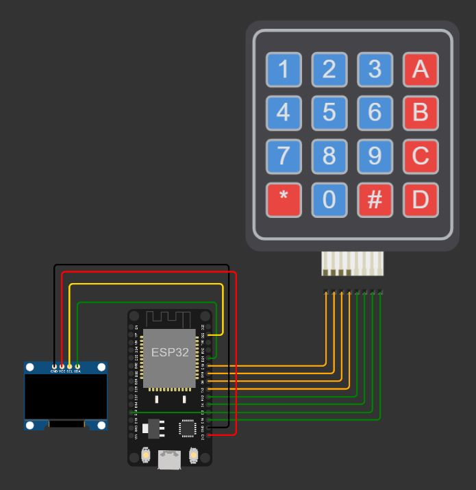

# Project 2 - Keypad Inputs

The program works as password authentication using keypad module as input. 4x4 keypad is used with multicharacter configuration. Output display using 128x64 pixel OLED module.

> type `TeTiTb2021` as the passkey.

### Setup

-   Program is built with Arduino IDE. ESP32 plugin is required to run the program.
-   Please install these libraries on Arduino IDE

    -   Adafruit SSD1306
    -   Adafruit GFX Library

-   Connect ESP32 modul and select port.
-   Run using the "Upload" button.

